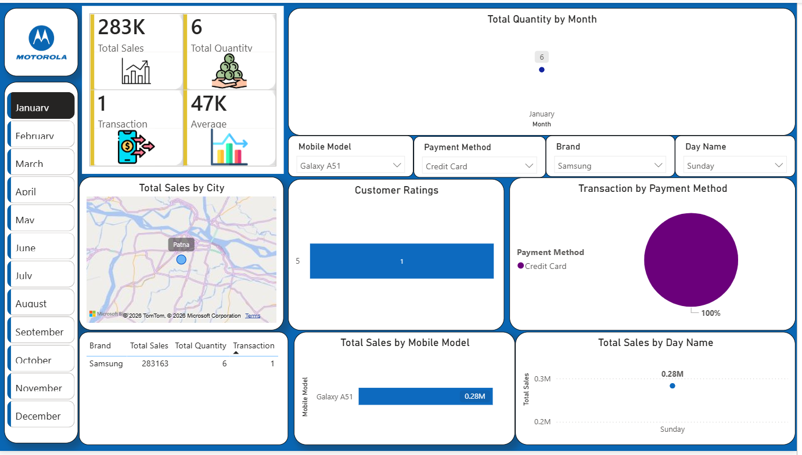
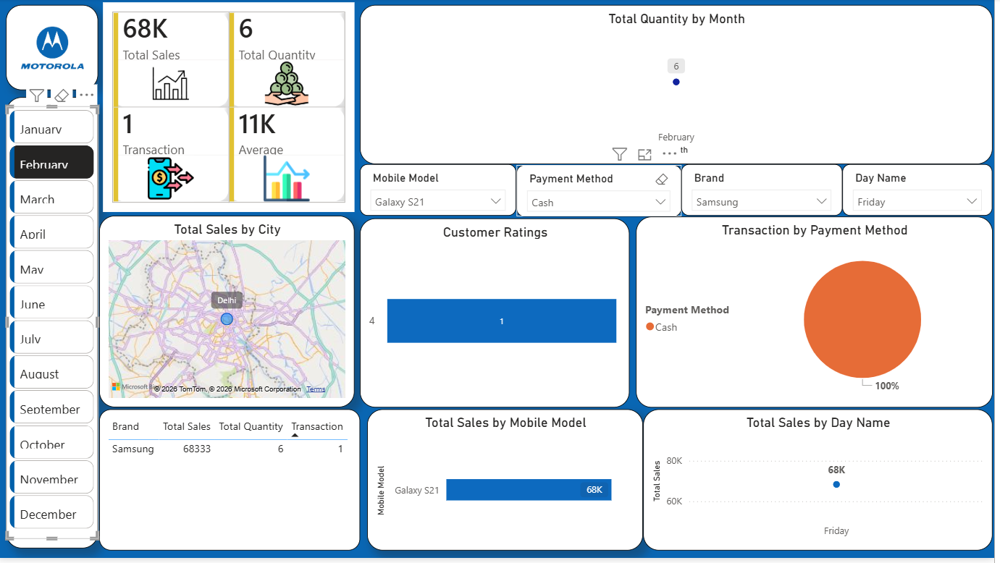
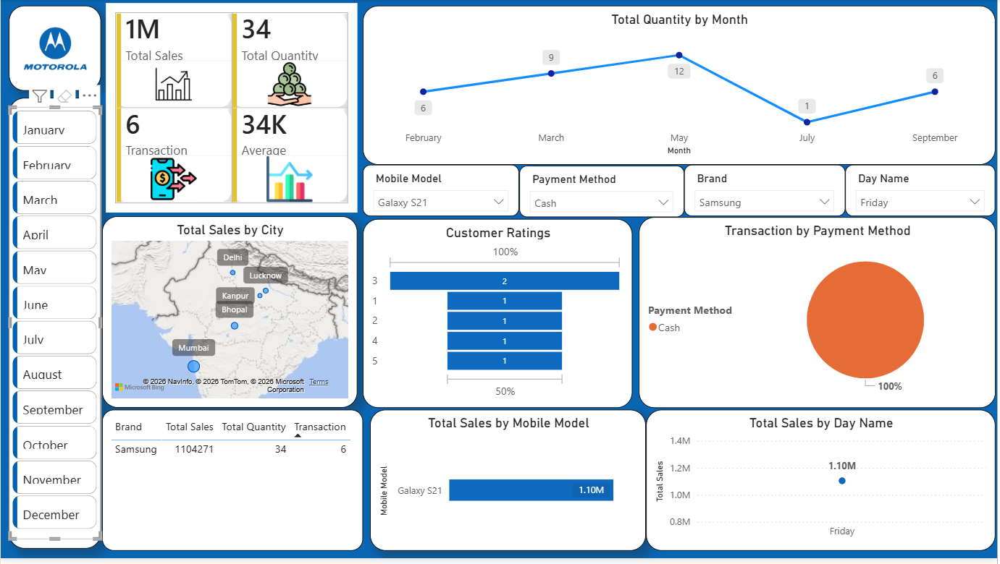
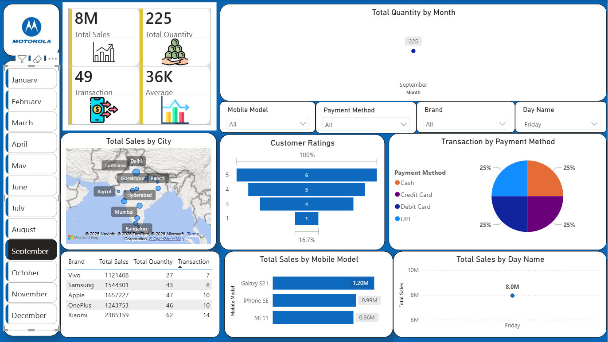

# Mobile-Sales-Analysis-Dashboard-Motorola-
Built an interactive Power BI dashboard to analyze mobile sales, transactions, and customer behavior Created KPIs such as Total Sales, Quantity, and Transactions using DAX. Implemented slicers and multiple visuals (map, bar, pie, line charts) to analyze sales by brand, city, payment method and time.

## Dataset used
<a href="https://github.com/Sakshikumari02/Mobile-Sales-Analysis-Dashboard-Motorola-/blob/main/Day%20-%2030%20-%20Mobile%20Sales%20Data.xlsx">Mobile Sales Data</a>

## KPIs
- KPI Metrics
- Total Sales – Overall revenue generated from mobile sales
- Total Quantity Sold – Total number of mobiles sold
- Average Price – Average selling price per mobile
- Total Transactions – Total sales/orders completed
- Customer Ratings – Average customer feedback/rating analysis
- Top Brand Performance – Highest selling mobile brand analysis
- Top Mobile Model – Best-performing mobile model by sales
- Sales by Payment Method – UPI / Card / Cash transaction analysis
- Sales by City/Region – Location-wise sales distribution
- Monthly Sales Trend – Month-wise sales performance tracking
- Year-over-Year Comparison – Previous year vs current year sales comparison

## Dashboard Interaction   
<a href="https://github.com/Sakshikumari02/Mobile-Sales-Analysis-Dashboard-Motorola-/blob/main/PBI4.pbix"> View Dashboard</a>

## Process
- Collected and understood mobile sales dataset
- Cleaned and transformed raw data using Power Query
- Checked missing values and corrected data types
- Created relationships between tables (if needed) in Power BI data model
- Built DAX measures for KPI calculations such as Total Sales, Quantity Sold, Average Price, and Transactions
- Developed KPI Cards to highlight key business metrics
- Designed visualizations for brand-wise sales, city-wise sales, payment method analysis, and monthly trends
- Added slicers and filters for interactive analysis
- Used charts, maps, and comparison visuals for better business insights
- Created a final interactive dashboard for sales performance tracking and decision-making

## Dashboard Screenshot

## Project Insights
- Identified the overall sales performance and total revenue generated from mobile sales
- Analyzed top-performing mobile brands and best-selling models
- Observed customer buying patterns across different cities/regions
- Compared sales performance using different payment methods
- Tracked monthly sales trends to identify growth and decline patterns
- Evaluated average selling price and total transaction performance
- Analyzed customer ratings to understand product/customer satisfaction
- Compared year-over-year sales performance for business growth analysis
